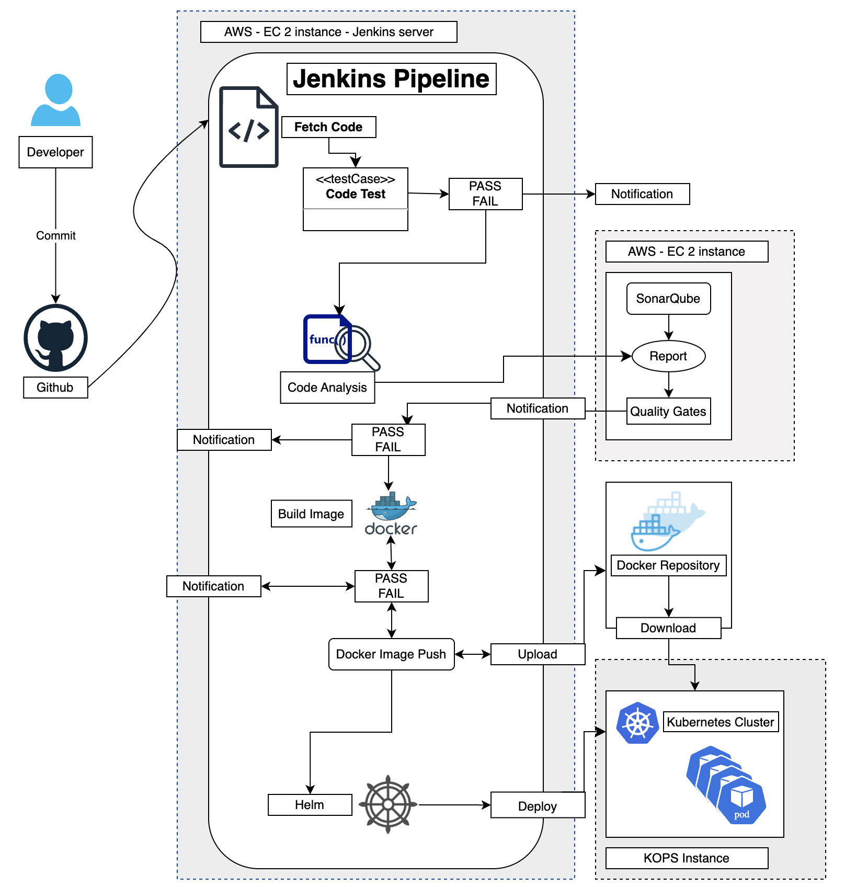

# Scalable, Secure User Management & Authentication Microservice for Enterprise APIs

## 📌 Overview
This project is a **scalable and secure authentication & user management microservice**, designed for **enterprise APIs**. It provides **centralized authentication, role-based access control (RBAC), and user identity management** with **high availability and security** in mind. 

Built using **Node.js, MongoDB, Docker, Kubernetes, Helm, and CI/CD tools**, this microservice serves as a foundation for **enterprise-grade applications**, ensuring seamless user authentication, secure API access, and efficient identity management.

---

## 📂 Project Structure
- **auth-service**: A **Node.js-based authentication microservice** that handles user registration, login, and access control, with **MongoDB** as the database.
- **other-services**: Planned future extensions with different frameworks for additional functionalities.

---

## 🔧 Prerequisites
Ensure you have the following installed:
- **Node.js**
- **Docker**
- **Kubernetes**
- **Helm**
- **Jenkins**
- **SonarQube**
- **Git**
- **Kops (Kubernetes Operations)**

---

## 🏛️ Architecture Diagram



---

## Folder Structure

```plaintext
.
├── README.md
├── auth-service
│   ├── Dockerfile
│   ├── Jenkinsfile
│   ├── README.Docker.md
│   ├── auth-service-helm
│   │   ├── charts
│   │   └── templates
│   │       ├── NOTES.txt
│   │       ├── _helpers.tpl
│   │       ├── auth-app.yaml
│   │       ├── auth-service.yaml
│   │       ├── hpa.yaml
│   │       ├── ingress.yaml
│   │       ├── serviceaccount.yaml
│   │       └── tests
│   │           └── test-connection.yaml
│   ├── compose.yaml
│   ├── config
│   │   └── default.json
│   ├── model
│   │   └── user.js
│   ├── mongodb-helm
│   │   ├── charts
│   │   ├── mongo-config.yaml
│   │   ├── mongo-secret.yaml
│   │   └── templates
│   │       ├── NOTES.txt
│   │       ├── _helpers.tpl
│   │       ├── hpa.yaml
│   │       ├── ingress.yaml
│   │       ├── mongo-app.yaml
│   │       ├── mongo-service.yaml
│   │       ├── serviceaccount.yaml
│   │       └── tests
│   │           └── test-connection.yaml
│   ├── package-lock.json
│   ├── package.json
│   ├── routes
│   │   └── users.js
│   ├── server.js
│   ├── startup
│   │   ├── db.js
│   │   ├── routes.js
│   │   └── validation.js
│   └── test
│       └── users.test.js
└── microserviceArch1.jpg
```

---

## 🚀 Setting Up the Project (auth-service)

### 1️⃣ Clone the Repository
```sh
git clone https://github.com/akhilk2802/blogs-microservices.git
cd blogs-microservices
```

### 2️⃣ Install Dependencies
```sh
cd auth-service
npm install
```

### 3️⃣ Run Tests Locally
```sh
npm test
```

### 4️⃣ Run the Application Locally
```sh
npm start
```

### 5️⃣ Dockerize the Application
```sh
docker build -t {docker-username}/auth-service .
```

### 6️⃣ Push the Dockerized Application
```sh
docker login
docker push {docker-username}/auth-service
```

### 7️⃣ Deploy to Kubernetes using Helm
Ensure Helm and Kubernetes are configured before deploying:
```sh
helm upgrade --install auth-service ./auth-service-helm \
  --set image.repository={docker-username}/auth-service \
  --set image.tag=latest
```

### 8️⃣ Deploy to Kubernetes using Kops
```sh
kops create cluster --name=${K8S_CLUSTER_NAME} --state=${K8S_STATE_STORE} \
  --zones=us-west-2a --node-count=2 --node-size=t2.micro \
  --master-size=t2.micro --dns-zone=${K8S_CLUSTER_NAME}
  
kops update cluster ${K8S_CLUSTER_NAME} --yes --state=${K8S_STATE_STORE}
kops validate cluster --state=${K8S_STATE_STORE}
```

---

## 🔄 CI/CD Pipeline with Jenkins
This CI/CD pipeline automates **building, testing, and deploying** the authentication service:

1. **Fetch Code**: Clones the repository from GitHub.
2. **Install Dependencies**: Installs Node.js dependencies.
3. **Run Tests**: Executes unit and integration tests.
4. **SonarQube Analysis**: Runs static code analysis.
5. **Quality Gate Check**: Verifies code quality using SonarQube.
6. **Build Docker Image**: Creates a Docker image for `auth-service`.
7. **Push Docker Image**: Uploads the Docker image to Docker Hub.
8. **Remove Unused Docker Images**: Cleans up locally stored images.
9. **Deploy to Kubernetes with Helm**: Deploys `auth-service` to Kubernetes using Helm.

---

🚀 **Scalable, Secure User Management & Authentication Microservice - Designed for Enterprise APIs!**

